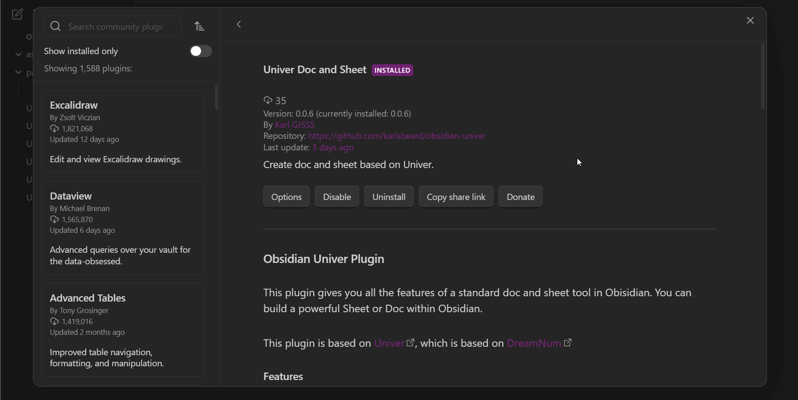
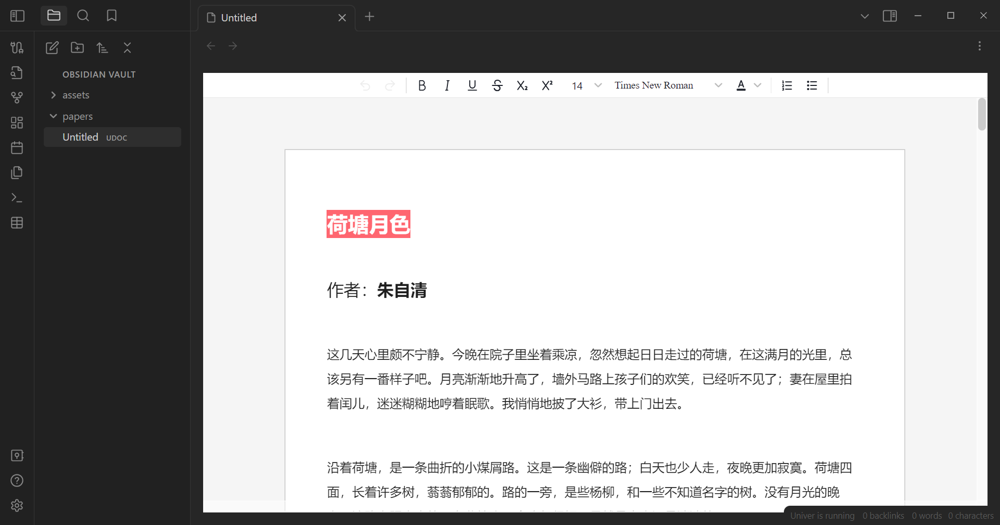
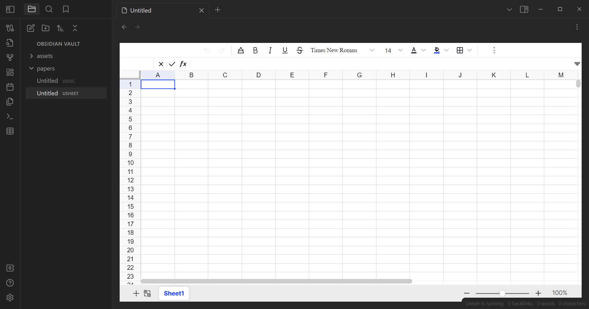

# Obsidian Univer Plugin
This plugin gives you all the features of a standard doc and sheet tool in Obisidian. You can build a powerful Sheet or Doc within Obsidian.

This plugin is based on [Univer](https://github.com/dream-num/univer), which is based on [DreamNum](https://github.com/dream-num)

### Features

#### Sheet
- Rich text formatting - change fonts, size, colors, borders, cell color, line-wrapping, etc
- Formulas - several build in formulas
- Filter and sort
- Cells - merge cells, resize cells, drag cells

#### Doc
- Rich text formatting - change fonts, size, colors, borders, cell color, line-wrapping, etc

### How to use:
1. Install the plugin
2. Create a new file(USheet or UDoc) by clicking on the "Doc" or "Sheet" modal button.

### How to perfect the plugin

Univer team is so glad that you can join and help us perfect the plugin and the Univer ecology, You have many ways to join and help us.
- Clone the repository and `pnpm i` then `pnpm dev` or `pnpm build` so that you can perfect the Univer-plugin.
- You can create Univer plugins in the community that you want. You can contact us so that we can help you publish the Univer plugins in the Univer community.

### I18N feature

Univer supports the English and Chinese. Now you can choose the language in the plugin setting option. You can find the detail information follow the recording display below.

### Screenshots

