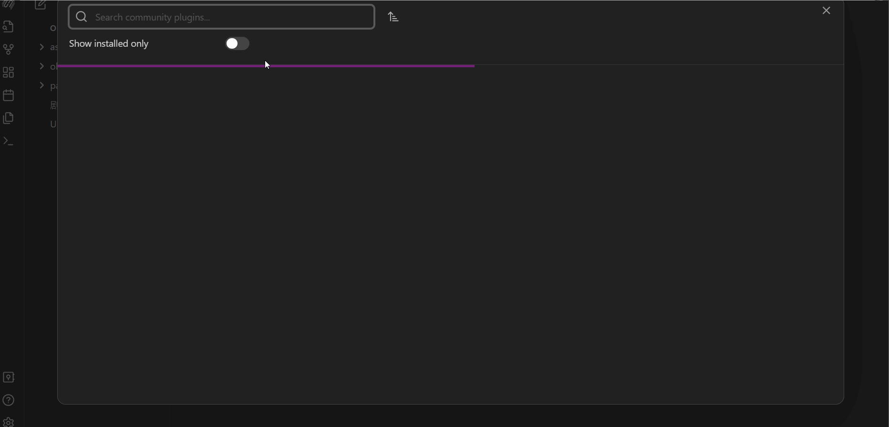
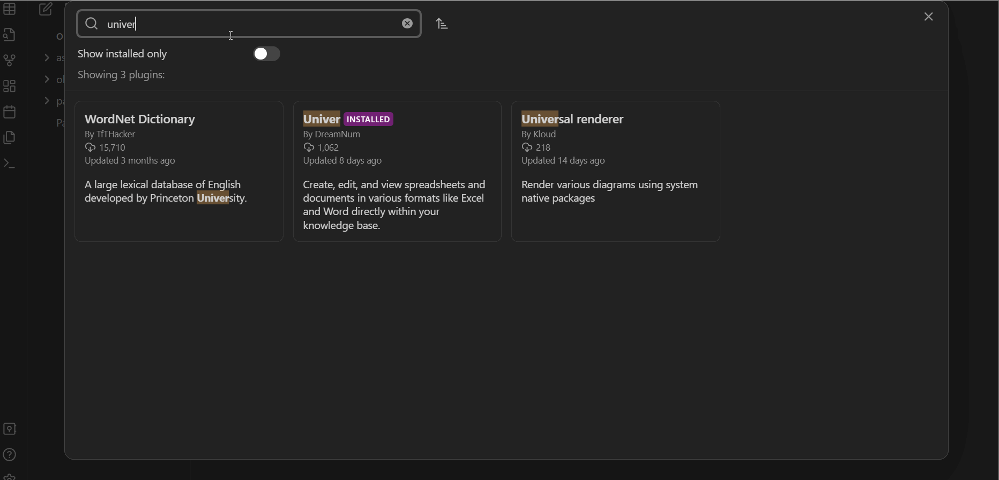

    <picture>
        <source media="(prefers-color-scheme: dark)" srcset="./assets/banner-light.png">
        
    </picture>

    
    

# Obsidian Univer Plugin
This plugin gives you all the features of a standard doc and sheet tool in Obisidian. You can build a powerful Sheet or Doc within Obsidian.

This plugin is based on [Univer](https://github.com/dream-num/univer), which is based on [DreamNum](https://github.com/dream-num)

## Core Features

| <h3>📊 Univer Sheets</h3> | |
| :------------------------ | :------------------- |
| [Sheets](https://www.univer.ai/examples/sheets/) Opened: cell styles, formulas. First quarter: conditional formatting, data validation, search and replace. Second quarter (tentative): floating pictures, filtering, sorting, annotations, charts, pivot tables, super tables (tables), shaped |  |

| <h3>📝 Univer Docs</h3> | |
| :---------------------- | :------------------- |
| [Docs](https://www.univer.ai/examples/docs/) Already open: ordered and unordered lists, paragraph settings, mixed graphics and text, multi-column/single column display in sections (tentative): hyperlinks, comments, tables, charts |  |

## I18N feature

Univer supports the English and Chinese. Now you can choose the language in the plugin setting option. You can find the detail information follow the recording display below.

## How to install and use

Text tutorial:

1. First of all, you should turn on the community plugins.
2. Second, click the browse to open the community plugins market.
3. Third, input the "univer" text into the search bar so that you can find this univer plugin.
4. Last but not least, click the install button and just wait for a while until the plugin has successfully installed. Please don't worry because the obsidian will give you a notice.
5. After that the most important step comes, you click the enable button, and the obsidian may notice you that "Failed to  load plugin univer".
6. To solve this problem, you just need to reload the obsidian and click the enable button again or just open the plugin in your menu of installed plugins.
7. Create a new file(USheet or UDoc) by clicking on the "Doc" or "Sheet" modal button.
8. Thank god, you can use the univer plugin to create your sheet or doc file now.

Image tutorial:

